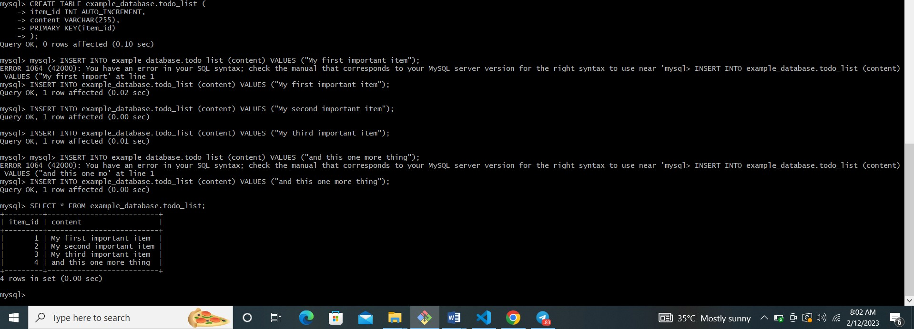

### DOCUMENTATION OF PROJECT 2

## web stack implementation  (LEMP STACK)

## step 0 - preparing prerequisites

AWS account

EC2 instance of t2.nano family with ubuntu 22.04LTS

create the instance and ssh into the instance as we have done in project1.

## step 1 - installing nginx web server

`sudo apt update`

`sudo apt install nginx`

To verify that nginx was succesfully installed and is running asa service in ubuntu, run;

`sudo systemctl status nginx` 

if it is green and running, then you did everything correctly.

Before we can receive any traffic by our Web Server, we need to open TCP port 80 which is default port that web browsers use to access web pages in the Internet.

`curl http://localhost:80`

Open a web browser of your choice and try to access following url;

*http//public-IP-address:80*

## step 2 - installing mysql

`sudo apt install mysql-server`

`sudo mysql`

`ALTER USER 'root'@'localhost' IDENTIFIED WITH mysql_native_password BY 'PassWord.1';`

then exit mysql.

Start the interactive script by running:

`sudo mysql_secure_installation`

put in PassWord.1 as the password. Then select y or Y for the question brought up

select 0,1 or 2 as the level of password validation.

press y for yes and enter key for further questions that are being asked.

When you're finished, test if you're able to login to the mysql console by typing:

`sudo mysql -p`

put in your new password

To exit the console:

mysql> `exit`

## step 3 - installing php

`sudo apt install php-fpm php-mysql`

When prompted, type Y and press ENTER to confirm installation.

## step 4 - configuring nginx to use php processor

`sudo mkdir /var/www/projectLEMP`

`sudo chown -R $USER:$USER /var/www/projectLEMP`

then, open a new configuration file using nano editor

`sudo nano /etc/nginx/sites-available/projectLEMP`

This will create a blank file. Paste in the following bare-bones configuration:

#/etc/nginx/sites-available/projectLEMP

server {
 listen 80;
 server_name projectLEMP www.projectLEMP;
 root /var/www/projectLEMP;
 
 index index.html index.htm index.php;
 
 location / {
     try_files $uri $uri/ =404;
 }
 
 location ~ \.php$ {
     include snippets/fastcgi-php.conf;
     fastcgi_pass unix:/var/run/php/php8.1-fpm.sock;
  }
 
 location ~ /\.ht {
     deny all;
 }
 
}

When you’re done editing, save and close the file. If you’re using nano, you can do so by typing CTRL+X and then y and ENTER to confirm.

Activate your configuration by linking to the config file from Nginx’s sites-enabled directory:

`sudo ln -s /etc/nginx/sites-available/projectLEMP /etc/nginx/sites-enabled/`

We also need to disable default Nginx host that is currently configured to listen on port 80, for this run:

`sudo unlink /etc/nginx/sites-enabled/default`

reload nginx;

`sudo systemctl reload nginx`

Your new website is now active, but the web root /var/www/projectLEMP is still empty. Create an index.html file in that location so that we can test that your new server block works as expected:

`sudo echo 'Hello LEMP from hostname' $(curl -s http://169.254.169.254/latest/meta-data/public-hostname) 'with public IP' $(curl -s http://169.254.169.254/latest/meta-data/public-ipv4) > /var/www/projectLEMP/index.html`

Now go to your browser and try to open your website URL using IP address:

*http://public-IP-address:80*

## step 5 - Testing PHP with nginx

`sudo nano /var/www/projectLEMP/info.php`

Type or paste the following lines into the new file. This is valid PHP code that will return information about your server:

`<?php
phpinfo();`

You can now access this page in your web browser by visiting the domain name or public IP address you’ve set up in your Nginx configuration file, followed by /info.php:

`http://`server_domain_or_IP`/info.php`

Thhen remove with ;

sudo rm /var/www/projectLEMP/info.php

## step 6 - Retrieving data from mysql database with php(continued)

sudo mysql -p

To create a new database, run the following command from your MySQL console:

`CREATE DATABASE example_database;`

Now you can create a new user and grant him full privileges on the database you have just created.

`CREATE USER 'example_user'@'%' IDENTIFIED WITH mysql_native_password BY 'password';`

`GRANT ALL ON example_database.* TO 'example_user'@'%';`

Now exit mysql

You can test if the new user has the proper permissions by logging in to the MySQL console again, this time using the custom user credentials:

`mysql -u example_user -p`

mysql> SHOW DATABASES;

This will give you the following output:

Output
+--------------------+

| Database        |
+--------------------+

| example_database   |

| information_schema |

+--------------------+

2 rows in set (0.000 sec)

Next, we’ll create a test table named todo_list. From the MySQL console, run the following statement:

CREATE TABLE example_database.todo_list (

item_id INT AUTO_INCREMENT,

content VARCHAR(255),

PRIMARY KEY(item_id)

);

Insert a few rows of content in the test table. You might want to repeat the next command a few times, using different VALUES:

mysql> `INSERT INTO example_database.todo_list (content) VALUES ("My first important item");`

To confirm that the data was successfully saved to your table, run:

mysql> `SELECT * FROM example_database.todo_list;`

You’ll see the following output:

you can exit mysql

Now create z PHP script that will connect to mysql and query for your content.

`nano /var/www/projectLEMP/todo_list.php`

# copy this content into your todo_list.php script:

Save and close the file when you are done editing.

You can now access this page in your web browser by visiting the domain name or public IP address configured for your website, followed by /todo_list.php:

`http://<Public_domain_or_IP>/todo_list.php`

You should see a page like this, showing the content you’ve inserted in your test table:

That means your PHP environment is ready to connect and interact with your MySQL server.